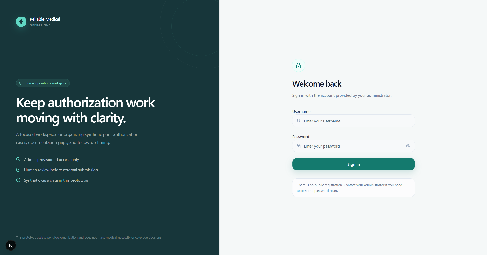
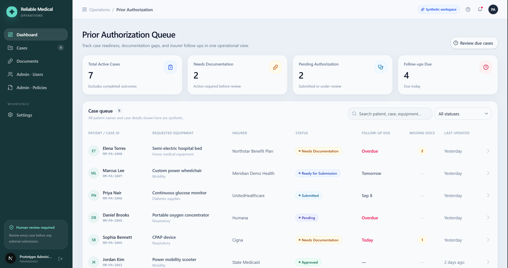
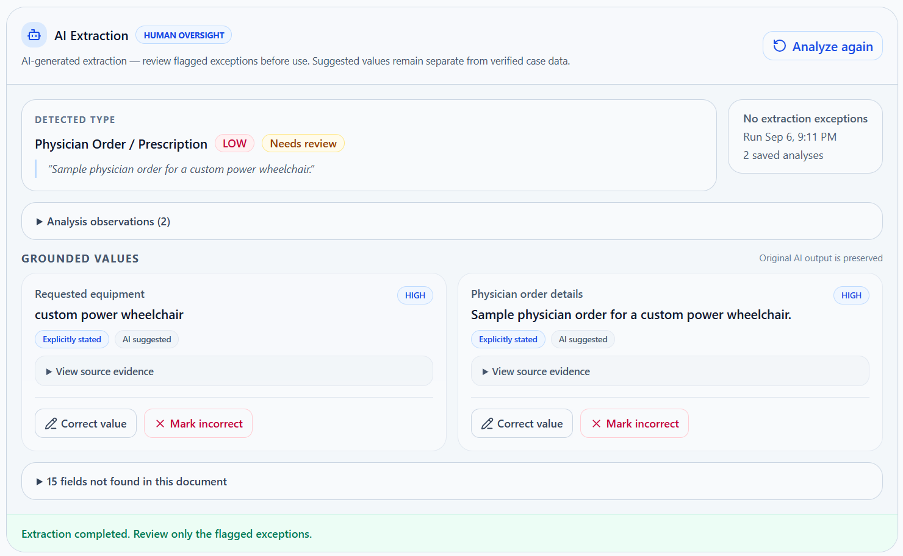
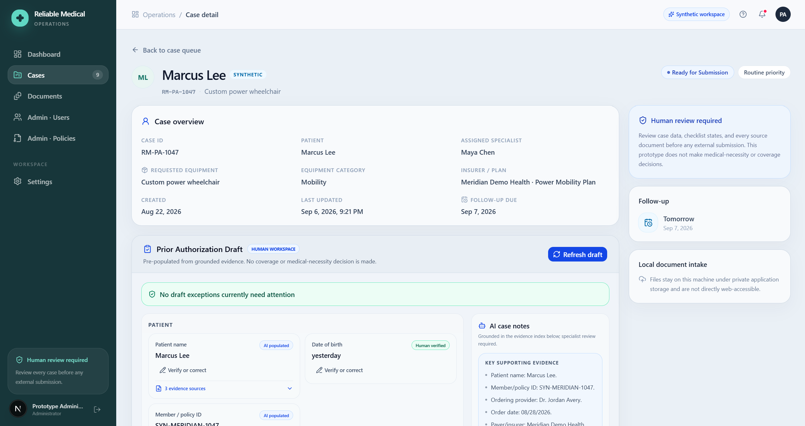
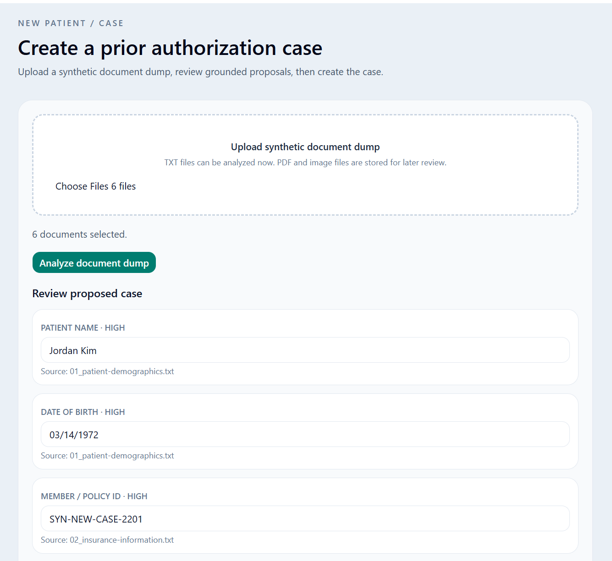
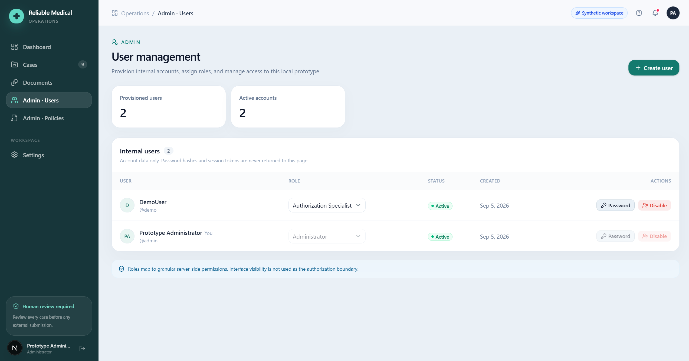

# Prior Authorization Copilot

AI-assisted prior authorization workflow prototype for Reliable Medical.

I chose Reliable Medical from Gauge Capital's current portfolio. Rather than guessing at an internal AI opportunity from a short portfolio description, I reviewed Reliable Medical's current job postings to understand the work people actually do. The Prior Authorization Specialist role stood out because it combines document review, payer-specific administrative requirements, request preparation, status tracking, follow-up across phone/fax/email/portals, and denial handling.

This case-study prototype focuses on reducing the repetitive document-review and administrative work in that workflow. Every patient, payer, policy, document, and authorization record in this repository is synthetic. No real PHI is used.



*The product shell and operations workspace for a synthetic prior-authorization team.*

## The Problem

Prior authorization specialists routinely need to:

- read information spread across orders, chart notes, evaluations, and insurance documents;
- identify patient, provider, equipment, and policy-relevant facts;
- find missing documentation and reconcile conflicting values;
- prepare request materials and track authorization status and follow-up; and
- respond to denials without losing the evidence behind the original request.

The workflow is a strong AI-assistance opportunity because much of the input is unstructured or semi-structured, facts are buried in documents, and the work is repetitive. It is also a poor fit for an opaque end-to-end decision-maker: administrative rules, permissions, audit history, and consequential choices need deterministic behavior and human review.

## Solution Overview

```text
Documents
   ↓
Grounded AI extraction
   ↓
Human verification
   ↓
Pre-populated prior-authorization draft
   ↓
Deterministic payer-readiness evaluation
   ↓
Submission preparation and communications
   ↓
Status and follow-up tracking
   ↓
Denial and appeal assistance
   ↓
PDF / DOCX export
```

The model is an extraction and drafting assistant. It does not make coverage, medical-necessity, or approval decisions.

## 1. Operational Case Queue



*A centralized queue for synthetic cases, statuses, follow-up timing, and documentation gaps.*

The dashboard gives specialists a working view of active cases, including status, due dates, missing-document counts, and last-updated timestamps. Search, status filters, due-case filtering, active/archived views, and full-row case navigation keep the daily queue easy to scan.

## 2. Grounded AI Document Extraction



*Structured candidate facts remain tied to the document and source evidence that supports them.*

Uploaded synthetic documents can be classified and analyzed server-side with the OpenAI Responses API. Structured outputs produce focused candidate facts rather than an unbounded narrative.

Key safeguards:

- confidence levels and concise source quotes are retained for important facts;
- quotes are checked against the selected source document;
- missing values remain missing rather than being guessed;
- ambiguous values and true conflicts are surfaced for review; and
- unsupported HCPCS codes and other details are never invented.

Specialists can verify a value, edit and save it as verified, or mark an incorrect value. Original AI output remains separate from the human-verified result.

## 3. Pre-Populated Prior Authorization Workspace



*A case-level draft aggregates trusted case data and reviewed evidence while keeping exceptions visible.*

Multiple documents contribute to one prior-authorization draft. Trusted structured case values are reused first, human-verified evidence takes priority over suggestions, and high-confidence grounded suggestions are lower priority. Missing data stays missing. Conflicting values are shown with their source documents instead of being silently resolved.

The result is an exception-focused workspace: specialists spend time resolving meaningful gaps and contradictions rather than re-entering facts the system already knows. Every populated field remains traceable to its source and review state.

## 4. Create a Case from a Document Dump



*A document packet can propose a new synthetic case before anything becomes authoritative.*

An authorized user can upload a multi-document packet for a patient who is not yet in the system:

1. Upload documents and analyze supported TXT files.
2. Review grounded patient, payer, provider, and request fields.
3. Edit or confirm the proposed values and review duplicate warnings.
4. Create a canonical `RM-PA-####` case.
5. Promote the uploaded files into that case and continue in the normal workflow.

The user confirms identity and request information before case creation. Unknown values remain unknown.

## Payer Policy and Administrative Readiness

The prototype includes a small synthetic payer-policy library with version and effective-date metadata. Policy matching is deterministic and uses configured payer, plan, equipment category, and explicitly verified HCPCS data. Requirements are evaluated from the current verified draft and can be `PRESENT`, `MISSING`, `NEEDS_REVIEW`, `CONFLICT`, or `NOT_APPLICABLE`.

The LLM does not decide authorization readiness. TypeScript evaluates structured verified data against configured policy requirements. Readiness means administrative/document preparation status only; it is not a coverage, eligibility, or medical-necessity decision.

## Submission Preparation and Communications

Once a case has a readiness result, specialists can prepare an authorization request and draft:

- an authorization request;
- initial and follow-up emails;
- a fax cover sheet;
- a concise insurer phone script; and
- an additional-information response.

Communication generation uses trusted and human-verified case data plus the current readiness and policy context. Drafts persist with their generated and edited versions, require human review before use, and are never sent automatically. Submission status, reference numbers, and follow-up timing remain explicit workflow data.

## Denial and Appeal Assistance

For a denied synthetic case, the workflow can:

- extract the stated denial reason and any deadline or instruction with source evidence;
- compare the denial against verified case evidence and deterministic policy requirements;
- distinguish an evidence gap from a possible submission discrepancy; and
- prepare a grounded appeal draft for specialist review.

The appeal assistant does not claim that a payer is wrong, fabricate clinical support, or promise an outcome. It uses only verified case information and keeps evidence visible beside the draft.

## Exports

The finalized prior-authorization workspace can be exported as:

- a professionally formatted PDF; and
- an editable DOCX working document.

Exports are built from trusted case-record values, human-verified facts, reviewed clinical support, verified documents, and submission metadata. They clearly label draft/not-ready states, include the relevant patient/provider/insurance/request sections, and retain the synthetic-data and human-review disclaimer. Unresolved AI suggestions are not presented as verified facts.

## 5. Access Control and Administration



*Admin-only controls for users, policies, and protected operations.*

This is an internal operations application with no public registration. Administrators provision accounts; users authenticate with a username and password. The foundation includes:

- Argon2id password hashing;
- opaque server-side sessions in HttpOnly cookies;
- granular RBAC permissions beneath the initial roles;
- admin user and synthetic policy management;
- protected case and document operations, including deletion controls; and
- audit-event foundations that associate meaningful actions with users and resources.

The app has no ChatGPT account requirement and does not use Google, Firebase, or another external identity provider. This prototype uses synthetic data only and does not claim HIPAA compliance. A real PHI deployment would require organizational security and compliance review, appropriate vendor agreements/BAAs, approved infrastructure, encryption and key-management controls, monitoring, retention policies, and production identity/SSO controls.

## AI, Deterministic Logic, and Human Control

| AI assistance | Deterministic TypeScript | Human specialist |
| --- | --- | --- |
| Document classification | RBAC enforcement | Verify and correct evidence |
| Structured extraction | Case and submission state | Resolve true conflicts |
| Semantic normalization | Payer-policy matching | Review communications |
| Grounded case notes | Readiness requirements and statuses | Choose consequential actions |
| Communication drafting | Audit logic and follow-up timing | Record submission details |
| Appeal drafting | File handling and persistence | Review appeals and external actions |

The model is a component of the workflow, not the source of truth.

## Technology

- **Frontend/full stack:** Next.js 16, React, TypeScript
- **Database:** SQLite with Drizzle ORM
- **AI:** OpenAI Responses API, configurable `gpt-5.4-mini` default, Zod structured outputs
- **Security:** Argon2id, opaque server-side sessions, HttpOnly cookies, granular RBAC
- **Exports:** custom server-side PDF and DOCX renderers in `web/lib/exports/`
- **Testing:** Node `node:test`, `tsx`, and mocked/network-independent AI tests

## Architecture

```text
Browser
  ↓
Next.js / TypeScript
  ├── Authentication + RBAC
  ├── Case, document, draft, and submission workflows
  ├── Deterministic payer readiness
  ├── Communication and appeal services
  │
  ├── Drizzle ORM → SQLite
  │
  └── Server-side OpenAI Responses API
          ↓
      Structured outputs
          ↓
      Grounded candidate facts and drafts
          ↓
      Human verification before use
```

## Synthetic Demo Cases

The easy-to-find source packets live under [`web/demo-data/`](web/demo-data/). The repository contains no real PHI.

- **Marcus Lee — `RM-PA-1047`:** complete, internally consistent happy-path packet.
- **Elena Torres — `RM-PA-1048`:** intentionally incomplete packet with meaningful documentation gaps.
- **Amira Hassan — `RM-PA-1042`:** denied scenario with supporting evidence and an accessory-justification gap for appeal review.
- **New Case Demo Patient — `RM-NEW-CASE_Demo-Patient`:** document-dump packet specifically for creating a new case; one equipment detail is intentionally ambiguous.

The packet README in `web/demo-data/` explains the synthetic-only purpose of each folder.

## Suggested Demo Flow

1. Open the dashboard and show the synthetic case queue.
2. Open Marcus Lee and review the uploaded documents.
3. Analyze a document and show grounded evidence and verification.
4. Open the pre-populated prior-authorization draft.
5. Show deterministic readiness and its requirement explanations.
6. Generate a communication or authorization request draft for review.
7. Export the verified workspace as PDF and DOCX.
8. Open the new-case intake packet and show review-before-create.
9. Open Amira Hassan to demonstrate denial evidence comparison and appeal assistance.

## Local Setup

Requires Node.js 22.13 or later.

```powershell
cd web
npm install
Copy-Item .env.example .env.local
# Edit .env.local and set a local SEED_ADMIN_PASSWORD.
npm run db:seed-admin
npm run dev
```

The app runs at [http://localhost:3000](http://localhost:3000). The local `.env.local` file should contain a strong development-only seed password. Set `OPENAI_API_KEY` only when using live server-side analysis or communication generation; mocked tests do not need network access. The OpenAI key is never sent to the browser.

The app applies the local SQLite schema/migrations under `web/db/migrations/` before repositories query the current schema. For a clean local setup, start the app once after creating `.env.local`. Keep `web/.env.example` as the source of variable names and do not commit secrets or the local database.

For a production-mode smoke test:

```powershell
npm run build
npm start
```

In development, an administrator can use **Admin → Users → Reset Demo Data** to restore the canonical synthetic cases and policies. The reset preserves user accounts and credentials.

## Test and Quality Checks

The current test command is:

```powershell
npm test
```

It runs the repository's Node/`tsx` test files covering authentication and RBAC, case workflows, document extraction and review, prior-auth drafting, payer readiness, communications, exports, new-case intake, and deletion/archive behavior. At the time this README was finalized, the full suite reported **37 passing tests**.

The remaining checks are:

```powershell
npm run typecheck
npm run lint
npm run build
```

## Current Boundaries and Production Evolution

This is a case-study prototype, not a production clinical system. Current boundaries include:

- synthetic data only;
- TXT as the primary AI-analyzable document format, with local storage for other supported uploads;
- no production OCR pipeline;
- synthetic payer policies rather than official policy retrieval;
- no payer portal integrations or automatic email/fax submission;
- no coverage or medical-necessity decisions; and
- local SQLite/file storage and local admin-provisioned authentication rather than enterprise SSO.

A production evolution could add approved OCR and document processing, an approved/BAA-backed AI configuration, PostgreSQL or another managed relational database, encrypted object storage, enterprise SSO, official payer-policy ingestion and versioning, approved payer APIs/RPA where appropriate, and formal monitoring, audit, retention, and incident-response controls.
